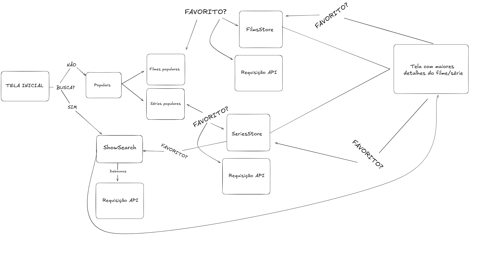
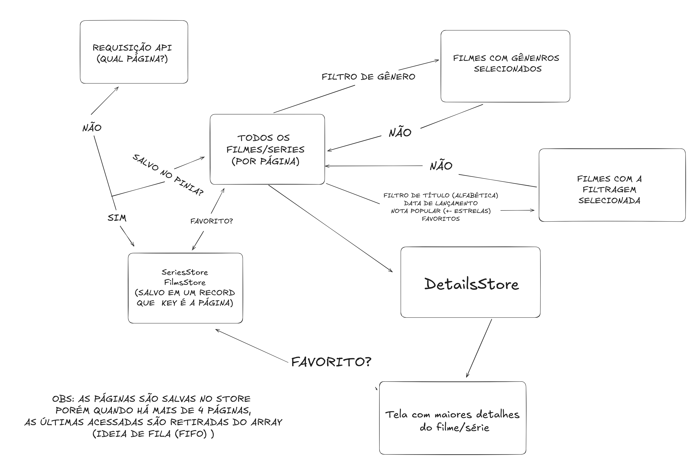
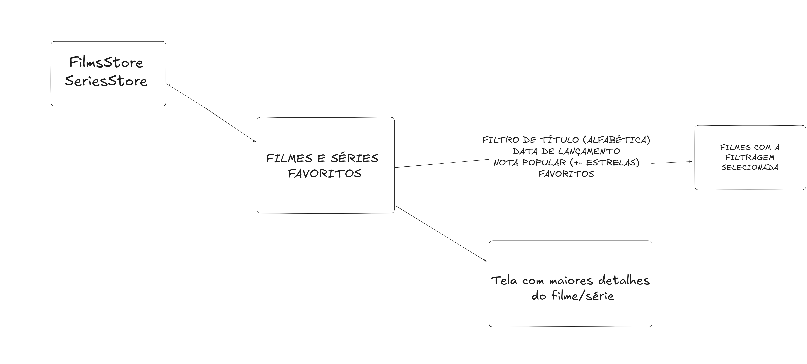

# Vue.js Catálogo de filmes - Norven

Este é uma aplicação em **Vue.js** que utiliza **Axios** para realizar requisições HTTP e **Pinia** para gerenciar o estado global da aplicação. O objetivo da aplicação é buscar filmes da API do TMDB (The Movie Database) e exibir as informações dos filmes na interface.

## Estrutura do Sistema  

### **Tela Inicial**  
- Exibe opções de busca por filmes e séries.  
- Realiza requisições à API para obter os resultados.  
- Usuário pode selecionar itens como favoritos.  
  **Busca e Filtragem**  
- Busca de filmes e séries através de uma API.  
- Possibilidade de filtrar por gênero, título, data de lançamento e popularidade.  
 
 **Abaixo acompanhe o fluxo da tela inicial**
  

### **Detalhes de todos os Filme/Série**  
- Tela com mais informações sobre todos os filme ou série.  
- Exibição baseada nos dados obtidos pela API.  

 **Abaixo acompanhe o fluxo das telas de Filmes e Séries**
  


### **Detalhes de um filme/série específico**  
- Tela com mais informações sobre o filme ou série escolhido/a.  
- Possibilidade de colocar como favorito  

 **Abaixo acompanhe o fluxo da tela de mais detalhes**
  


### **Armazenamento de Favoritos**  
- Os favoritos são armazenados no `filmsStore`,`seriesStore`, `searchStore` e `detailsStore`.  
- O sistema mantém um histórico limitado, priorizando os útlimos itens acessados.  
- Manutenção de memória

## Tecnologias Utilizadas

- **Vuetify**: Para construção da interface.
- **Axios**: Cliente HTTP para fazer requisições à API.
- **Pinia**: Gerenciamento de estado global na aplicação.
  **Router** : Gerenciar as rotas da aplicação
- **TMDB API**: API que fornece informações sobre filmes, séries e outros dados relacionados ao cinema.

## Funcionalidades

- Mostra os filmes e séries mais vistos;
- Exibição de resultados: Mostra uma lista de filmes com informações como título, imagem e descrição.
- Gerenciamento de estado global: Usa o Pinia para armazenar os dados da pesquisa e o estado de carregamento.
- Integra a possibilidade de favorito em todas as telas
- Mostra todos os filmes/séries em uma só tela
- Possibilidade de filtros

## Organização de pastas
📦 catalogo-filmes-project
├── 📂 fluxogramas          
│   ├── FilmsSeries.png
│   ├── moreDetails.png
│   ├── Populars.png
│
├── 📂 public               
│   ├── favicon.ico
│   ├── index.html
│
├── 📂 src                  
│   ├── 📂 assets           
│   │   ├── 📂 images
│   │   │   ├── bg-image.jpg
│   │   ├── logo.svg
│   │
│   ├── 📂 components       
│   │   ├── 📂 index       
│   │   │   ├── populars.vue
│   │   │   ├── popularsSection.vue
│   │   │   ├── showSearch.vue
│   │   ├── pageDetails.vue
│   │   ├── footer.vue
│   │   ├── heropage.vue
│   │   ├── navbar.vue
│   │
│   ├── 📂 pages           
│   │   ├── Home.vue
│   │   ├── Details.vue
│   │   ├── Search.vue
│   │
│   ├── 📂 plugins          
│   │   ├── vuetify.js
│   │   ├── axios.js
│   │
│   ├── 📂 router           
│   │   ├── index.ts
│   │
│   ├── 📂 services         
│   │   ├── api.ts
│   │
│   ├── 📂 stores           
│   │   ├── detailsStore.ts
│   │   ├── filmsStore.ts
│   │   ├── searchStore.ts
│   │   ├── seriesStore.ts
│   │
│   ├── 📂 styles           
│   │   ├── settings.scss
│   │   ├── global.scss
│   │
│   ├── 📂 types            
│   │   ├── types.ts
│   │
│   ├── App.vue            
│   ├── main.ts             


## Pré-requisitos

Antes de rodar o projeto, você precisa ter as seguintes ferramentas instaladas:

- **Node.js**

## Como Rodar a Aplicação

### 1. Clone o Repositório

```bash
git clone https://github.com/seu-usuario/vue-movie-finder.git
```

### 2. Instalar as dependências

```bash
npm install
```

## Configure a chave API do TMDB

Para interagir com a API do TMDB, você precisa de uma chave de API. Siga os passos abaixo:

Crie uma conta no TMDB: https://www.themoviedb.org/

Crie uma chave de API: https://www.themoviedb.org/settings/api

Depois de obter sua chave de API, crie um arquivo .env na raiz do projeto e adicione a chave da seguinte forma:

```bash
VITE_API_TOKEN=sua-chave-da-api
```
